# 👋 Hello there! I'm Pepe Varela

After completing my **Bachelor in Mechanical Engineering** at the **University of Málaga (UMA)**, I’ve been focusing my career on **data analysis, artificial intelligence, and data engineering** by pursuing a [**Master’s in Big Data, Artificial Intelligence, and Data Engineering**](https://www.bigdata.uma.es).

My goal is to contribute to the world of engineering and real-world applications through critical thinking and data-driven insights, leveraging data as a tool to solve complex challenges and create meaningful impact.

---

## 👤 About Me

- 🔍 Passionate about **Industrial Engineering, Machine Learning, and AI systems design**.  
- ⚙️ Focused on **end-to-end data workflows**, from ingestion to model deployment.  
- 🧩 Exploring **LLMs**, **vector databases**, and **intelligent automation**.  
- 💬 Open to collaboration and building projects that merge **Artificial Intelligence + Industrial Engineering**.  

---

## ⚡ Tech Snapshot

```mermaid
%%{init: {
  'theme': 'base',
  'themeVariables': {
    'primaryColor': '#4285F4',
    'primaryTextColor': '#ffffff',
    'primaryBorderColor': '#4285F4',
    'secondaryColor': '#DB4437',
    'tertiaryColor': '#F4B400',
    'lineColor': '#0F9D58',
    'edgeLabelBackground': '#9AA0A6',
    'fontFamily': 'Inter, monospace',
    'fontSize': '14px'
  }
}}%%
mindmap
  root((Technical Skills))
    🐍 Programming
      Python
      MATLAB
    🧠 Machine Learning & AI
      PyTorch
      TensorFlow
      Scikit-Learn
      Pandas
      Polars
      NumPy
      Optuna
      MLflow
      HuggingFace
      LangChain
      Ollama
    ⚙️ Data Engineering & MLOps
      Apache Spark
      Kafka
      Airflow
      Prefect
      MinIO
      Azure
      Docker
    🧮 Databases & Storage
      PostgreSQL
      TimescaleDB
      MongoDB
      Qdrant
      Oracle SQL
    📊 Visualization & Analytics
      Matplotlib
      Seaborn
      Plotly
      Streamlit
    🧰 Tools & Collaboration
      Git
      VS Code
      Google Colab
      conda
      uv
```

---

## 🔗 Let's Connect

  &nbsp;
  

---

  <i>“Engineering intelligence through data.”</i>

